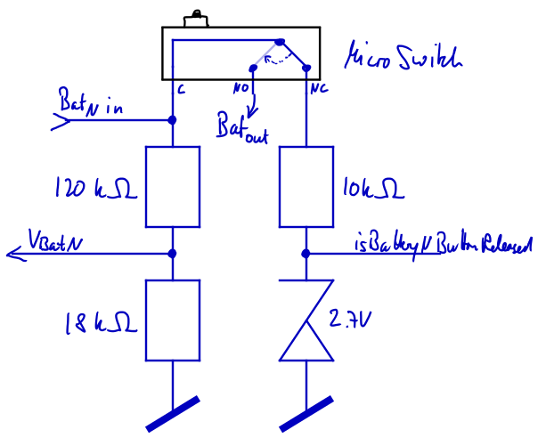

# Battery Carousel

Source code for the thingiverse project here: https://www.thingiverse.com/thing:7268332

## Hardware

Target HW:
- Arduino Pro Mini, ATmega328P 3.3V, 8MHz
- Display: SSD1306 OLED 128x32 pixel via i2c
- Servo: "Micro Servo 99 SG90" modified for 360 degrees turning
- 3x MicroSwitch, 20mm x 10mm x 6mm

Schematic:

For each of the 3 batteries the following simple setup is used:


i.e. we measure voltage of each battery (adjust voltage divider
if you have different batteries and/or analog input range). In addition
we use the `NC` pin of the micro switch to detect if the battery
is currently not active (convert to digital signal via Z-Diode).

Arduino Pin Mapping

| Pin  | Function                 | Notes          |
| ---- | ------------------------ | -------------- |
| D6   | isBattery1ButtonReleased | digital input  |
| D4   | isBattery2ButtonReleased | digital input  |
| D2   | isBattery3ButtonReleased | digital input  |
| D9   | Motor PWM                | digital output |
| A0   | voltage_battery1         | analog input   |
| A2   | voltage_battery2         | analog input   |
| A3   | voltage_battery3         | analog input   |
| A4   | SDA Display              |                |
| A5   | SCL Display              |                |
| 3.3V | VCC Display              |                |


## Software

Libraries:
- Adafruit BusIO v1.17.4 for SPI, Wire
- Adafruit GFX Library v1.12.3
- Adafruit SSD1306 v2.5.15


### testing

Unit tests:

```
mkdir build && cd build
cmake ..
make run_tests
```